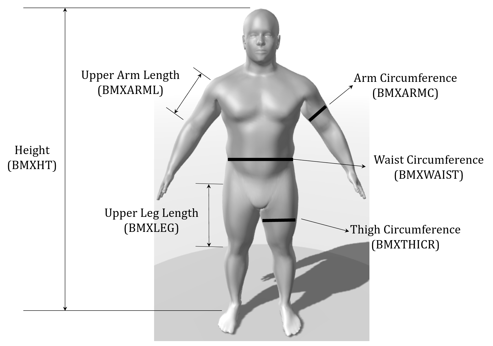

This project uses the NAHES dataset, comprising of approximately 4000 individuals' body measurements (such as weight, height and waist circumference) as well as body composition (gathered through DEXA scans - the gold standard). We have developed step-wise, ridge, and LASSO regression models to estimate body fat and total mass at different body segments (e.g., trunk, legs), further simplifying these regression equations for ease of interpretation and application. These predictive tools can have applications in health and fitness, as well as biomechanical studies.

```{r introduction, echo=FALSE, fig.cap="", out.width = '100%'}

```

```{r setup, include=FALSE}
knitr::opts_chunk$set(echo = FALSE, message = FALSE, warning = FALSE)
```

```{r, echo = FALSE}
knitr::opts_chunk$set(fig.path = "README_figs/README-")
```

```{r, child = 'exploring_data.Rmd'}
```

```{r, child = 'stepwise_regression.Rmd'}
```

```{r, child = 'gen_formula.Rmd'}
```

# References
https://www.datacamp.com/tutorial/tutorial-ridge-lasso-elastic-net