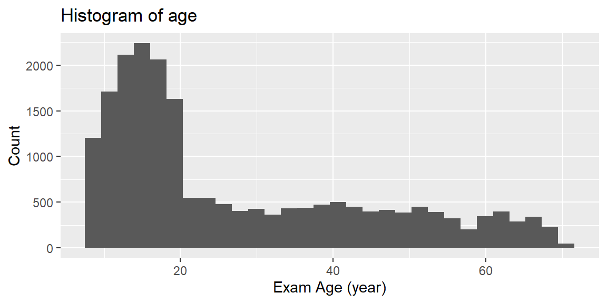
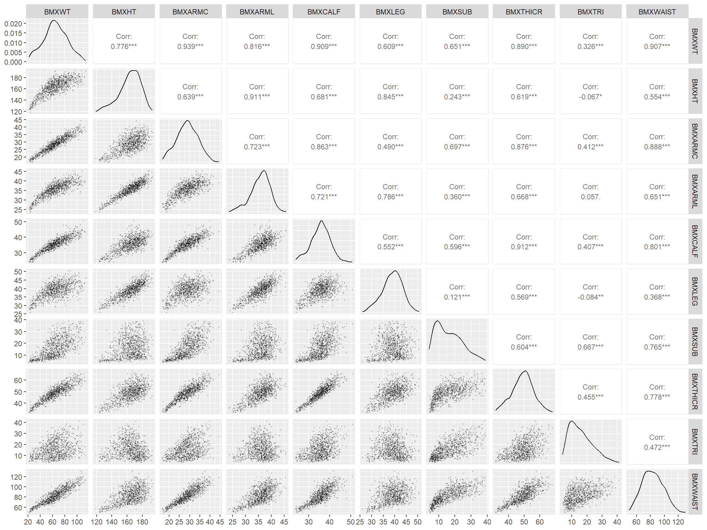
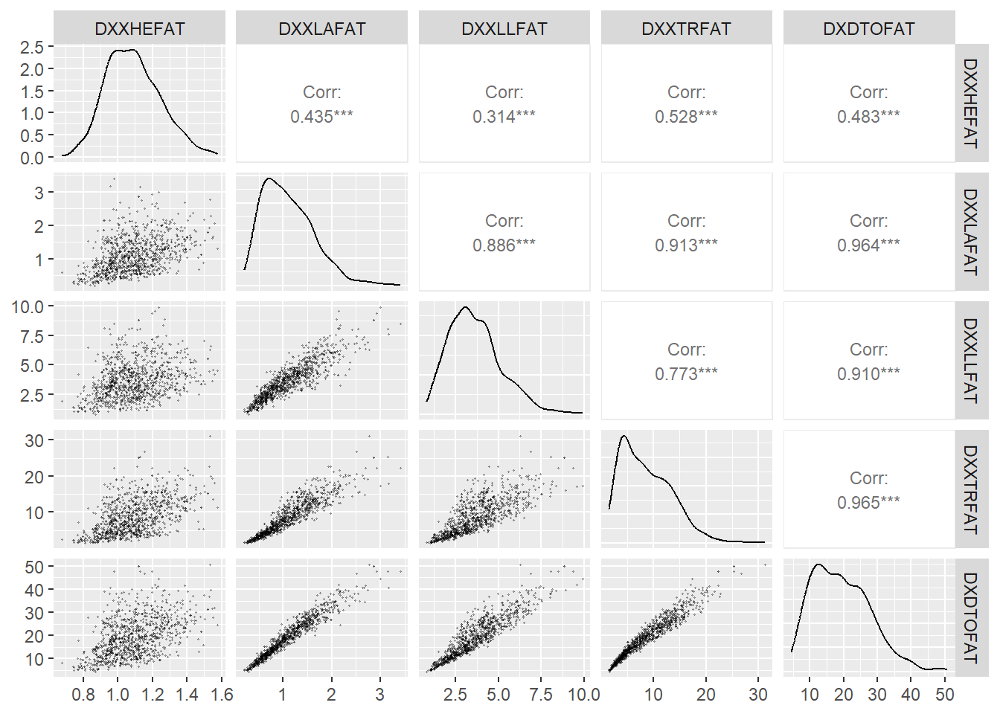
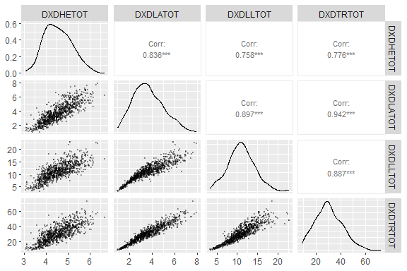

# Data Exploration

## List of independent and dependent variables
Dependent variables only reported for the left side of body

Table: List of independent variables

|         |description                     |
|:--------|:-------------------------------|
|BMXWT    |Weight (kg)                     |
|BMXHT    |Standing Height (cm)            |
|RIAGENDR |Gender (0 male, 1 female)       |
|RIDAGEEX |Exam Age (year)                 |
|BMXWAIST |Waist Circumference (cm)        |
|BMXARMC  |Arm Circumference (cm)          |
|BMXTHICR |Thigh Circumference (cm)        |
|BMXCALF  |Maximal Calf Circumference (cm) |
|BMXARML  |Upper Arm Length (cm)           |
|BMXLEG   |Upper Leg Length (cm)           |
|BMXTRI   |Triceps Skinfold (mm)           |
|BMXSUB   |Subscapular Skinfold (mm)       |

Table: List of dependent variables

|         |description                         |
|:--------|:-----------------------------------|
|DXXHEFAT |Head Fat (kg)                       |
|DXXLAFAT |Left Arm Fat (kg)                   |
|DXXLLFAT |Left Leg Fat (kg)                   |
|DXXTRFAT |Trunk Fat (kg)                      |
|DXDTOFAT |Total Fat (kg)                      |
|DXDHETOT |Head Total (kg)                     |
|DXDLATOT |Left Arm Total (kg)                 |
|DXDLLTOT |Left Leg Total (kg)                 |
|DXDTRTOT |Trunk Total (kg)                    |
|DXDTOBMC |Total Bone Mineral Content (kg)     |
|DXDTOBMD |Total Bone Mineral Density (g/cm^2) |
|DXDHEPF  |Head Percent Fat                    |
|DXDLAPF  |Left Arm Percent Fat                |
|DXDLLPF  |Left Leg Percent Fat                |
|DXDTRPF  |Trunk Percent Fat                   |
|DXDTOPF  |Total Percent Fat                   |

## Exploring demographics
The number of females are a little bit higher than males. Age distribution does not match the age distribution of USA population. Therefore, estimations based on this sample may predict outcome variables for young people better than old ones.

Table: Summary of demographic variables

|         | vars|     n|   mean|     sd| median| trimmed|    mad| min| max| range|  skew| kurtosis|    se|
|:--------|----:|-----:|------:|------:|------:|-------:|------:|---:|---:|-----:|-----:|--------:|-----:|
|RIAGENDR |    1| 20235|  0.462|  0.499|      0|   0.452|  0.000|   0|   1|     1| 0.153|   -1.977| 0.004|
|RIDAGEEX |    2| 20235| 27.294| 17.246|     19|  25.115| 11.614|   8|  70|    62| 0.899|   -0.479| 0.121|

<!-- -->

## Exploring body measurements
Some of the variables show strong linear correlations and should be avoided as independent variables in regression analysis.

Table: Summary of body measurement variables

|         | vars|     n|    mean|     sd| median| trimmed|    mad|   min|   max| range|   skew| kurtosis|    se|
|:--------|----:|-----:|-------:|------:|------:|-------:|------:|-----:|-----:|-----:|------:|--------:|-----:|
|BMXWT    |    1| 20235|  64.551| 19.323|   63.8|  64.428| 19.274|  20.0| 131.4| 111.4|  0.109|   -0.275| 0.136|
|BMXHT    |    2| 20235| 163.163| 13.757|  164.7| 164.120| 13.047| 112.0| 192.8|  80.8| -0.611|    0.158| 0.097|
|BMXARMC  |    3| 20235|  28.801|  5.112|   29.0|  28.812|  5.337|  15.5|  45.7|  30.2|  0.002|   -0.429| 0.036|
|BMXARML  |    4| 20235|  35.666|  3.663|   36.0|  35.872|  3.410|  22.1|  46.3|  24.2| -0.492|    0.199| 0.026|
|BMXCALF  |    5| 20235|  35.759|  4.533|   36.0|  35.864|  4.448|  20.2|  52.8|  32.6| -0.166|    0.075| 0.032|
|BMXLEG   |    6| 20235|  38.908|  4.259|   39.2|  39.016|  4.151|  24.2|  52.0|  27.8| -0.229|   -0.054| 0.030|
|BMXSUB   |    7| 20235|  16.239|  8.050|   14.8|  15.559|  8.599|   3.6|  40.4|  36.8|  0.638|   -0.399| 0.057|
|BMXTHICR |    8| 20235|  49.145|  6.892|   49.3|  49.179|  6.672|  28.3|  74.3|  46.0|  0.008|   -0.017| 0.048|
|BMXTRI   |    9| 20235|  15.902|  7.506|   14.6|  15.248|  8.006|   3.0|  42.0|  39.0|  0.701|   -0.167| 0.053|
|BMXWAIST |   10| 20235|  83.046| 14.844|   82.0|  82.655| 15.716|  48.0| 138.7|  90.7|  0.273|   -0.390| 0.104|

<!-- -->

## Exploring DXA - Body parts fat weight
Data was only ploted for the left arm and leg

Table: Summary of body parts fat weights

|         | vars|     n|   mean|    sd| median| trimmed|   mad|   min|    max|  range|  skew| kurtosis|    se|
|:--------|----:|-----:|------:|-----:|------:|-------:|-----:|-----:|------:|------:|-----:|--------:|-----:|
|DXXHEFAT |    1| 20235|  1.087| 0.154|  1.074|   1.081| 0.162| 0.676|  1.659|  0.983| 0.360|   -0.212| 0.001|
|DXXLAFAT |    2| 20235|  1.108| 0.545|  1.024|   1.059| 0.539| 0.182|  3.843|  3.661| 0.961|    1.327| 0.004|
|DXXLLFAT |    3| 20235|  3.688| 1.581|  3.485|   3.558| 1.514| 0.705| 11.072| 10.367| 0.865|    0.991| 0.011|
|DXXTRFAT |    4| 20235|  8.786| 4.952|  7.920|   8.342| 5.297| 1.239| 31.199| 29.960| 0.791|    0.291| 0.035|
|DXDTOFAT |    5| 20235| 19.530| 8.814| 18.471|  18.887| 9.217| 4.029| 58.845| 54.815| 0.695|    0.337| 0.062|

<!-- -->

## Exploring DXA - Body parts total weight
Data was only ploted for the left arm and leg

Table: Summary of body parts total weights

|         | vars|     n|   mean|     sd| median| trimmed|    mad|   min|    max|  range|  skew| kurtosis|    se|
|:--------|----:|-----:|------:|------:|------:|-------:|------:|-----:|------:|------:|-----:|--------:|-----:|
|DXDHETOT |    1| 20235|  4.575|  0.631|  4.534|   4.557|  0.664| 2.849|  6.767|  3.918| 0.275|   -0.241| 0.004|
|DXDLATOT |    2| 20235|  3.689|  1.289|  3.583|   3.645|  1.350| 0.968|  8.288|  7.320| 0.328|   -0.333| 0.009|
|DXDLLTOT |    3| 20235| 11.094|  3.194| 11.006|  11.073|  3.087| 3.167| 23.581| 20.414| 0.148|    0.098| 0.022|
|DXDTRTOT |    4| 20235| 30.707| 10.518| 30.266|  30.508| 10.592| 8.561| 72.623| 64.062| 0.227|   -0.268| 0.074|

<!-- -->

# Building Regression Models

## Using all independent variables

### Stepwise regression models

Table: Step-wise regression model based on all independent variables

|         | (Intercept)|  BMXWT|  BMXHT| RIAGENDR| RIDAGEEX| BMXWAIST| BMXARMC| BMXTHICR| BMXCALF| BMXARML| BMXLEG| BMXTRI| BMXSUB|    R2|  RMSE|
|:--------|-----------:|------:|------:|--------:|--------:|--------:|-------:|--------:|-------:|-------:|------:|------:|------:|-----:|-----:|
|DXXHEFAT |       1.121|  0.114|  0.007|   -0.073|   -0.019|   -0.004|   0.013|   -0.006|      NA|  -0.006|     NA| -0.018|  0.019| 0.739| 0.079|
|DXXLAFAT |       1.044|  0.307| -0.128|    0.139|       NA|    0.117|   0.046|   -0.065|   0.008|   0.025| -0.006|  0.229|  0.006| 0.893| 0.179|
|DXXLLFAT |       3.414|  0.769| -0.293|    0.592|   -0.028|    0.173|  -0.646|    0.496|   0.254|   0.071|  0.074|  0.794| -0.127| 0.850| 0.612|
|DXXTRFAT |       8.217|  4.412| -1.157|    1.234|    0.202|    2.283|  -0.854|   -0.653|  -0.530|  -0.158| -0.236|  0.934|  0.326| 0.935| 1.263|
|DXDTOFAT |      18.311|  6.647| -1.957|    2.639|    0.131|    2.868|  -2.025|    0.229|      NA|      NA| -0.101|  2.970|  0.109| 0.937| 2.203|
|DXDHETOT |       4.689|  0.441|  0.095|   -0.247|   -0.038|   -0.107|   0.078|    0.017|      NA|  -0.026| -0.014| -0.087|  0.078| 0.736| 0.324|
|DXDLATOT |       3.779|  1.219| -0.139|   -0.195|   -0.026|   -0.218|   0.518|   -0.216|  -0.069|   0.092|  0.046| -0.102|  0.026| 0.970| 0.225|
|DXDLLTOT |      11.094|  2.911| -0.038|       NA|   -0.156|   -0.628|  -0.613|    0.736|   0.499|   0.116|  0.211|  0.320| -0.102| 0.966| 0.586|
|DXDTRTOT |      30.407| 10.649|  0.303|    0.650|    0.416|    1.772|   0.174|   -1.085|  -0.877|  -0.458| -0.441| -0.379|  0.123| 0.987| 1.217|
|DXDTOBMC |       2.109|  0.416|  0.253|    0.076|    0.051|   -0.263|   0.122|    0.076|  -0.040|      NA|     NA| -0.129|  0.021| 0.856| 0.235|
|DXDTOBMD |       1.073|  0.030|  0.069|    0.047|    0.022|   -0.066|   0.055|    0.046|  -0.010|      NA| -0.002| -0.044|  0.018| 0.667| 0.090|
|DXDHEPF  |      23.912|  0.130| -0.301|   -0.339|   -0.210|    0.459|  -0.096|   -0.207|   0.029|      NA|  0.047|  0.054|  0.012| 0.408| 0.422|
|DXDLAPF  |      27.714| -5.581| -1.331|    5.559|    0.221|    5.697|  -0.765|    0.629|   0.793|      NA| -0.169|  6.039|  0.344| 0.834| 4.336|
|DXDLLPF  |      30.551| -3.226| -1.893|    5.636|       NA|    3.958|  -2.603|    1.869|   0.528|   0.191|  0.158|  5.455| -0.623| 0.778| 4.451|
|DXDTRPF  |      25.555| -2.639| -1.840|    3.623|    0.305|    6.948|  -0.509|    0.380|  -0.299|   0.230| -0.281|  2.803|  1.509| 0.863| 3.286|
|DXDTOPF  |      27.503| -2.616| -1.895|    4.226|    0.171|    5.196|  -1.436|    0.811|   0.243|   0.196|     NA|  3.941|  0.506| 0.857| 3.087|

### Ridge regression

Table: Ridge regression model based on all independent variables

|         | (Intercept)|  BMXWT|  BMXHT| RIAGENDR| RIDAGEEX| BMXWAIST| BMXARMC| BMXTHICR| BMXCALF| BMXARML| BMXLEG| BMXTRI| BMXSUB|    R2|  RMSE|
|:--------|-----------:|------:|------:|--------:|--------:|--------:|-------:|--------:|-------:|-------:|------:|------:|------:|-----:|-----:|
|DXXHEFAT |       1.122|  0.107|  0.003|   -0.076|   -0.015|    0.000|   0.008|    0.000|   0.000|   0.000|  0.000| -0.015|  0.015| 0.738| 0.079|
|DXXLAFAT |       1.046|  0.270| -0.104|    0.134|    0.002|    0.131|   0.045|   -0.039|   0.000|   0.014| -0.010|  0.227|  0.008| 0.892| 0.179|
|DXXLLFAT |       3.415|  0.726| -0.270|    0.590|   -0.028|    0.176|  -0.621|    0.499|   0.255|   0.062|  0.070|  0.790| -0.119| 0.850| 0.612|
|DXXTRFAT |       8.217|  4.371| -1.138|    1.232|    0.202|    2.291|  -0.837|   -0.642|  -0.528|  -0.162| -0.242|  0.932|  0.325| 0.935| 1.263|
|DXDTOFAT |      18.312|  6.588| -1.979|    2.637|    0.126|    2.875|  -2.004|    0.222|   0.015|   0.048| -0.100|  2.967|  0.116| 0.938| 2.203|
|DXDHETOT |       4.689|  0.423|  0.085|   -0.247|   -0.037|   -0.089|   0.075|    0.017|   0.000|  -0.016| -0.006| -0.085|  0.072| 0.736| 0.324|
|DXDLATOT |       3.782|  1.144| -0.106|   -0.201|   -0.023|   -0.184|   0.514|   -0.189|  -0.061|   0.085|  0.038| -0.102|  0.024| 0.969| 0.225|
|DXDLLTOT |      11.093|  2.839| -0.011|    0.002|   -0.159|   -0.602|  -0.587|    0.742|   0.503|   0.107|  0.210|  0.313| -0.096| 0.966| 0.586|
|DXDTRTOT |      30.412| 10.658|  0.305|    0.641|    0.420|    1.769|   0.161|   -1.072|  -0.880|  -0.457| -0.447| -0.373|  0.116| 0.987| 1.217|
|DXDTOBMC |       2.113|  0.386|  0.257|    0.067|    0.049|   -0.242|   0.119|    0.069|  -0.022|   0.001|  0.000| -0.125|  0.016| 0.856| 0.236|
|DXDTOBMD |       1.077|  0.004|  0.072|    0.039|    0.020|   -0.045|   0.053|    0.043|   0.000|   0.000|  0.000| -0.040|  0.013| 0.665| 0.090|
|DXDHEPF  |      23.910|  0.081| -0.276|   -0.335|   -0.208|    0.468|  -0.077|   -0.180|   0.017|   0.000|  0.034|  0.050|  0.011| 0.407| 0.422|
|DXDLAPF  |      27.710| -5.516| -1.256|    5.569|    0.222|    5.686|  -0.732|    0.612|   0.769|  -0.129| -0.156|  6.043|  0.332| 0.834| 4.335|
|DXDLLPF  |      30.557| -3.234| -1.859|    5.624|    0.013|    3.950|  -2.613|    1.902|   0.510|   0.174|  0.140|  5.457| -0.622| 0.778| 4.451|
|DXDTRPF  |      25.554| -2.600| -1.823|    3.627|    0.302|    6.932|  -0.495|    0.362|  -0.302|   0.202| -0.284|  2.807|  1.501| 0.863| 3.286|
|DXDTOPF  |      27.503| -2.563| -1.853|    4.226|    0.165|    5.169|  -1.430|    0.820|   0.216|   0.183| -0.044|  3.948|  0.497| 0.857| 3.087|

### Lasso regression

Table: Lasso regression model based on all independent variables

|         | (Intercept)|  BMXWT|  BMXHT| RIAGENDR| RIDAGEEX| BMXWAIST| BMXARMC| BMXTHICR| BMXCALF| BMXARML| BMXLEG| BMXTRI| BMXSUB|    R2|  RMSE|
|:--------|-----------:|------:|------:|--------:|--------:|--------:|-------:|--------:|-------:|-------:|------:|------:|------:|-----:|-----:|
|DXXHEFAT |       1.122|  0.107|  0.003|   -0.076|   -0.015|    0.000|   0.008|    0.000|   0.000|   0.000|  0.000| -0.015|  0.015| 0.738| 0.079|
|DXXLAFAT |       1.046|  0.270| -0.104|    0.134|    0.002|    0.131|   0.045|   -0.039|   0.000|   0.014| -0.010|  0.227|  0.008| 0.892| 0.179|
|DXXLLFAT |       3.415|  0.726| -0.270|    0.590|   -0.028|    0.176|  -0.621|    0.499|   0.255|   0.062|  0.070|  0.790| -0.119| 0.850| 0.612|
|DXXTRFAT |       8.217|  4.371| -1.138|    1.232|    0.202|    2.291|  -0.837|   -0.642|  -0.528|  -0.162| -0.242|  0.932|  0.325| 0.935| 1.263|
|DXDTOFAT |      18.312|  6.588| -1.979|    2.637|    0.126|    2.875|  -2.004|    0.222|   0.015|   0.048| -0.100|  2.967|  0.116| 0.938| 2.203|
|DXDHETOT |       4.689|  0.423|  0.085|   -0.247|   -0.037|   -0.089|   0.075|    0.017|   0.000|  -0.016| -0.006| -0.085|  0.072| 0.736| 0.324|
|DXDLATOT |       3.782|  1.144| -0.106|   -0.201|   -0.023|   -0.184|   0.514|   -0.189|  -0.061|   0.085|  0.038| -0.102|  0.024| 0.969| 0.225|
|DXDLLTOT |      11.093|  2.839| -0.011|    0.002|   -0.159|   -0.602|  -0.587|    0.742|   0.503|   0.107|  0.210|  0.313| -0.096| 0.966| 0.586|
|DXDTRTOT |      30.412| 10.658|  0.305|    0.641|    0.420|    1.769|   0.161|   -1.072|  -0.880|  -0.457| -0.447| -0.373|  0.116| 0.987| 1.217|
|DXDTOBMC |       2.113|  0.386|  0.257|    0.067|    0.049|   -0.242|   0.119|    0.069|  -0.022|   0.001|  0.000| -0.125|  0.016| 0.856| 0.236|
|DXDTOBMD |       1.077|  0.004|  0.072|    0.039|    0.020|   -0.045|   0.053|    0.043|   0.000|   0.000|  0.000| -0.040|  0.013| 0.665| 0.090|
|DXDHEPF  |      23.910|  0.081| -0.276|   -0.335|   -0.208|    0.468|  -0.077|   -0.180|   0.017|   0.000|  0.034|  0.050|  0.011| 0.407| 0.422|
|DXDLAPF  |      27.710| -5.516| -1.256|    5.569|    0.222|    5.686|  -0.732|    0.612|   0.769|  -0.129| -0.156|  6.043|  0.332| 0.834| 4.335|
|DXDLLPF  |      30.557| -3.227| -1.858|    5.624|    0.013|    3.946|  -2.611|    1.900|   0.509|   0.172|  0.140|  5.457| -0.621| 0.778| 4.451|
|DXDTRPF  |      25.554| -2.600| -1.823|    3.627|    0.302|    6.932|  -0.495|    0.362|  -0.302|   0.202| -0.284|  2.807|  1.501| 0.863| 3.286|
|DXDTOPF  |      27.503| -2.563| -1.853|    4.226|    0.165|    5.169|  -1.430|    0.820|   0.216|   0.183| -0.044|  3.948|  0.497| 0.857| 3.087|

## Using only five independent variables

### Stepwise regression models

Table: Step-wise regression model based on only five easily-measurable independent variables

|         | (Intercept)|  BMXWT|  BMXHT| RIAGENDR| RIDAGEEX| BMXWAIST|    R2|  RMSE|
|:--------|-----------:|------:|------:|--------:|--------:|--------:|-----:|-----:|
|DXXHEFAT |       1.126|  0.118|  0.002|   -0.085|   -0.014|       NA| 0.732| 0.080|
|DXXLAFAT |       0.948|  0.406| -0.216|    0.346|   -0.013|    0.227| 0.823| 0.230|
|DXXLLFAT |       2.985|  1.534| -0.505|    1.523|   -0.285|    0.189| 0.717| 0.841|
|DXXTRFAT |       7.855|  2.366| -1.568|    2.017|    0.272|    3.214| 0.912| 1.470|
|DXDTOFAT |      16.895|  6.400| -3.011|    5.704|   -0.342|    4.047| 0.892| 2.893|
|DXDHETOT |       4.712|  0.544|  0.049|   -0.297|   -0.022|   -0.112| 0.727| 0.329|
|DXDLATOT |       3.865|  1.376| -0.057|   -0.382|    0.048|   -0.179| 0.951| 0.284|
|DXDLLTOT |      10.815|  4.193|     NA|    0.604|   -0.439|   -0.951| 0.942| 0.769|
|DXDTRTOT |      30.777|  7.681|  0.105|   -0.151|    0.820|    2.354| 0.981| 1.467|
|DXDTOBMC |       2.161|  0.560|  0.257|   -0.037|    0.061|   -0.323| 0.839| 0.249|
|DXDTOBMD |       1.086|  0.137|  0.054|    0.019|    0.023|   -0.090| 0.629| 0.095|
|DXDHEPF  |      23.904| -0.211| -0.214|   -0.323|   -0.191|    0.542| 0.387| 0.429|
|DXDLAPF  |      24.764| -0.903| -4.458|   11.947|   -0.706|    7.757| 0.694| 5.882|
|DXDLLPF  |      27.909|     NA| -3.760|   11.358|   -1.246|    5.123| 0.639| 5.674|
|DXDTRPF  |      23.994| -0.583| -3.749|    7.003|       NA|    8.703| 0.799| 3.981|
|DXDTOPF  |      25.494|     NA| -3.720|    8.576|   -0.519|    6.520| 0.750| 4.074|

### Ridge regression

Table: Ridge regression model based on only five easily-measurable independent variables

|         | (Intercept)|  BMXWT|  BMXHT| RIAGENDR| RIDAGEEX| BMXWAIST|    R2|  RMSE|
|:--------|-----------:|------:|------:|--------:|--------:|--------:|-----:|-----:|
|DXXHEFAT |       1.126|  0.117|  0.002|   -0.084|   -0.012|    0.000| 0.732| 0.080|
|DXXLAFAT |       0.949|  0.395| -0.211|    0.344|   -0.012|    0.231| 0.823| 0.230|
|DXXLLFAT |       2.986|  1.520| -0.498|    1.521|   -0.284|    0.196| 0.717| 0.841|
|DXXTRFAT |       7.855|  2.372| -1.568|    2.016|    0.272|    3.207| 0.912| 1.470|
|DXDTOFAT |      16.896|  6.420| -3.017|    5.703|   -0.337|    4.028| 0.892| 2.893|
|DXDHETOT |       4.712|  0.523|  0.055|   -0.297|   -0.023|   -0.096| 0.727| 0.329|
|DXDLATOT |       3.864|  1.339| -0.041|   -0.380|    0.043|   -0.151| 0.951| 0.285|
|DXDLLTOT |      10.817|  4.168|  0.005|    0.599|   -0.440|   -0.931| 0.942| 0.769|
|DXDTRTOT |      30.776|  7.718|  0.092|   -0.148|    0.823|    2.325| 0.981| 1.467|
|DXDTOBMC |       2.161|  0.542|  0.263|   -0.036|    0.058|   -0.306| 0.839| 0.249|
|DXDTOBMD |       1.088|  0.117|  0.060|    0.015|    0.019|   -0.072| 0.627| 0.095|
|DXDHEPF  |      23.903| -0.188| -0.220|   -0.320|   -0.187|    0.522| 0.387| 0.429|
|DXDLAPF  |      24.765| -0.819| -4.486|   11.946|   -0.693|    7.687| 0.694| 5.882|
|DXDLLPF  |      27.908|  0.126| -3.809|   11.360|   -1.237|    5.030| 0.639| 5.674|
|DXDTRPF  |      23.995| -0.504| -3.775|    7.001|    0.013|    8.637| 0.799| 3.982|
|DXDTOPF  |      25.499| -0.001| -3.710|    8.565|   -0.505|    6.501| 0.750| 4.074|

### Lasso regression

Table: Lasso regression model based on only five easily-measurable independent variables

|         | (Intercept)|  BMXWT|  BMXHT| RIAGENDR| RIDAGEEX| BMXWAIST|    R2|  RMSE|
|:--------|-----------:|------:|------:|--------:|--------:|--------:|-----:|-----:|
|DXXHEFAT |       1.126|  0.117|  0.002|   -0.084|   -0.012|    0.000| 0.732| 0.080|
|DXXLAFAT |       0.949|  0.395| -0.211|    0.344|   -0.012|    0.231| 0.823| 0.230|
|DXXLLFAT |       2.986|  1.520| -0.498|    1.521|   -0.284|    0.196| 0.717| 0.841|
|DXXTRFAT |       7.855|  2.372| -1.568|    2.016|    0.272|    3.207| 0.912| 1.470|
|DXDTOFAT |      16.896|  6.420| -3.017|    5.703|   -0.337|    4.028| 0.892| 2.893|
|DXDHETOT |       4.712|  0.523|  0.055|   -0.297|   -0.023|   -0.096| 0.727| 0.329|
|DXDLATOT |       3.864|  1.339| -0.041|   -0.380|    0.043|   -0.151| 0.951| 0.285|
|DXDLLTOT |      10.817|  4.168|  0.005|    0.599|   -0.440|   -0.931| 0.942| 0.769|
|DXDTRTOT |      30.776|  7.718|  0.092|   -0.148|    0.823|    2.325| 0.981| 1.467|
|DXDTOBMC |       2.161|  0.542|  0.263|   -0.036|    0.058|   -0.306| 0.839| 0.249|
|DXDTOBMD |       1.088|  0.117|  0.060|    0.015|    0.019|   -0.072| 0.627| 0.095|
|DXDHEPF  |      23.903| -0.188| -0.220|   -0.320|   -0.187|    0.522| 0.387| 0.429|
|DXDLAPF  |      24.764| -0.848| -4.477|   11.947|   -0.698|    7.712| 0.694| 5.882|
|DXDLLPF  |      27.908|  0.126| -3.809|   11.360|   -1.237|    5.030| 0.639| 5.674|
|DXDTRPF  |      23.995| -0.529| -3.768|    7.002|    0.013|    8.657| 0.799| 3.982|
|DXDTOPF  |      25.501|  0.000| -3.707|    8.562|   -0.501|    6.493| 0.750| 4.074|

# References
https://www.datacamp.com/tutorial/tutorial-ridge-lasso-elastic-net
